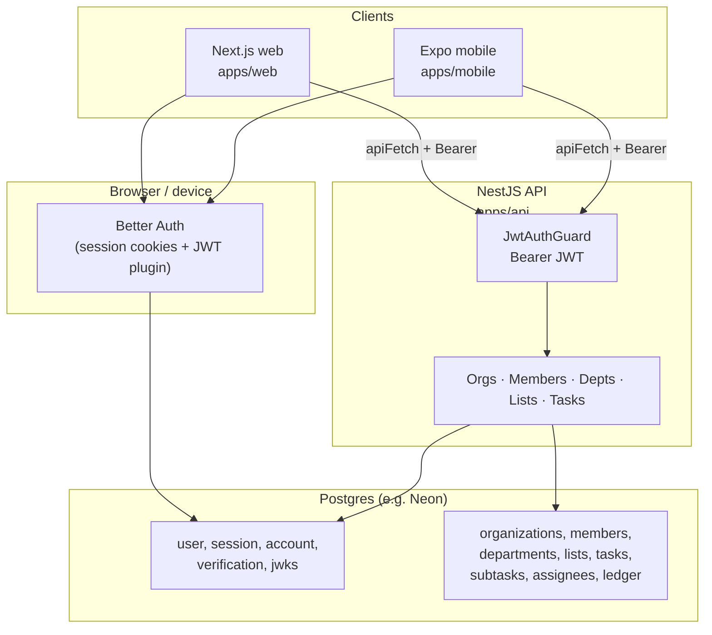

# LogBase / Work Ledger — system map (end-to-end)

**Product:** User-facing name **LogBase** (repo/package scope remains `@work-ledger/*`).  
This note is the **hub**: how pieces connect at runtime. Deep dives live in linked notes.

## One diagram (request + data)

**Dual use of Postgres:** the Next app runs **Better Auth** with Drizzle against the same database family as the API; **JWKS rows** back the JWT the API verifies remotely.

## Monorepo layout

| Piece | Path | Role |
|-------|------|------|
| Workspaces root | `package.json` | `apps/*`, `packages/*`; scripts `dev`, `dev:api`, `dev:web`, `db:*` |
| Shared DB schema + migrations | `packages/db` | Drizzle schema, `npm run db:migrate` at repo root |
| API input/output contracts (Zod) | `packages/contracts` | Imported by `apps/api` (validation); aligns with web/mobile types |
| HTTP API | `apps/api` | NestJS; prod typically **Railway** (`PORT`); local **`API_PORT`** or **4000**; **Socket.IO** on same process |
| Web app | `apps/web` | Next.js 16 on **Vercel** (prod), dev **3000**, Better Auth + React Query |
| Mobile | `apps/mobile` | Expo; same JWT + REST pattern; SQLite outbox for offline POSTs |

## Topic notes (read these next)

- [[apps-api]] — Nest modules, route map, guards, PDF report.
- [[apps-web]] — Routes under `/app`, middleware aliases, session → JWT → API chain.
- [[task-write-contracts-and-cache]] — **Task writes return slim JSON** (`ledgerDelta`); **GET task** returns full ledger; workspace bootstrap batches subtasks; web uses **`setQueryData`** — read this before integrating **another client**.
- [[web-ui-styling]] — Tailwind v4, CSS tokens, glass primary, theme switching (`Topics/Design/`).
- [[apps-mobile]] — Expo, token refresh, outbox.
- [[packages-and-data-layer]] — `@work-ledger/db` / `contracts`, dual ESM/CJS, migrations.
- [[postgres-node-pg-dns-ipv4first]] — optional: Node DNS order for `pg` (dual-stack / rollback).
- [[auth-jwt-and-env]] — JWKS URL, issuer/audience alignment, prod pitfalls (see also [[Chat-inbox]]).
- [[domain-authorization-and-tasks]] — Org hierarchy, roles, who sees which tasks, ledger semantics (`Topics/Domain/`).

## Quick commands (local)

- API + web together: `npm run dev` (concurrently api + web).
- DB migrate: `npm run db:migrate` (from repo root).
- Build web (ordered): `npm run build:web`.

## Related captures

Operational incidents and tuning (401s, Vercel routing, perf) are threaded in **`Inbox/Chat-inbox.md`** — search for auth, `NEXT_PUBLIC_API_URL`, JWKS.
